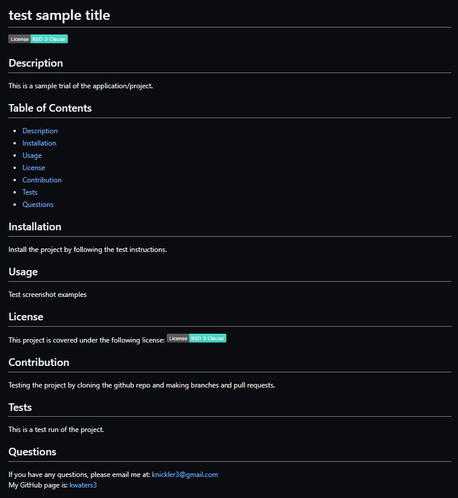

# README Generator
 
    
 
 ## Description
   The README generator creates a professional README for a new project by using a command-line application that accepts user input such as node.js and npm. The user is prompted with questions, requesting information/input to use in the output of the generated README file. 
 
 ## Table of Contents
   * [Description](#description)  
   * [Installation](#installation)
   * [Usage](#usage)
   * [License](#license)
   * [Contribution](#contribution)
   * [Tests](#tests)
   * [Questions](#questions)

## Visuals
  
   
 ## Installation
 To install the given application/project:
 
 * First, clone the git repository from [GitHub](https://github.com/kwaters3/README-Generator)

 * Next, install the required packages by using the following command: `npm install`

 * Then, invoke the application by using the following command: `node index.js` 

 * Finally, the user will be prompted with several questions/input data for their README file. 

 
 ## Usage
 How to use the application/project:

 * First, install the given application/project

 * Next, the command-line application will prompt for user input such as `project title`, `installation`, `usage`, `license`, `contribution`, `tests`, and `questions`. 

 * Finally, a high-quality README.md will be generated in the output folder/file. 

 
 ## License
   This project is covered under the following license: 
 
 ## Contribution
   If you would like to contribute, please clone the repository and create a new branch to add/update content.
 
 ## Tests
   The project can be tested by running it in the command line using node.js
 
 ## Questions
   If you have any questions, please email me at: knickler3@gmail.com  
   My GitHub page is: [kwaters3](https://github.com/kwaters3)
   